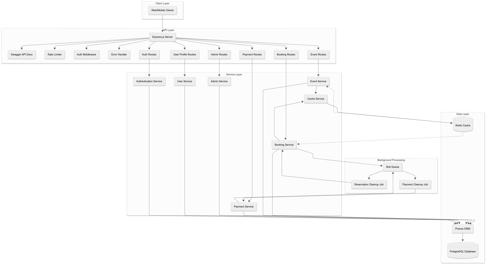
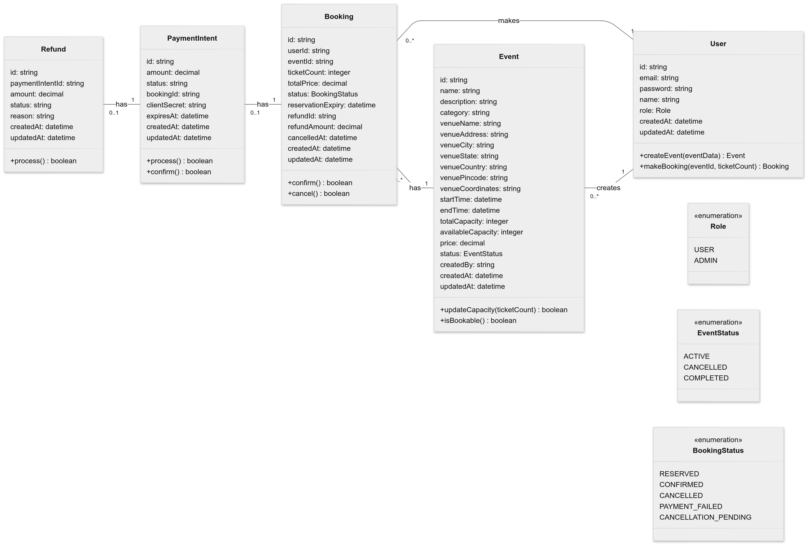

# Nuvio - Scalable Event Booking Backend

---

## 🌐 API Base URL & Documentation

- **API Base URL:**
  `https://evently-vsyz.onrender.com`

- **API Documentation (Swagger):**
  [https://evently-vsyz.onrender.com/api-docs](https://evently-vsyz.onrender.com/api-docs)
  Interactive Swagger UI is available at `/api-docs` for exploring all endpoints, request/response formats, and error codes.

---

## ✅ Core Features

### User Features

- **Browse Events:**
  Implemented with filtering, search, and pagination for a seamless experience.

- **Book Tickets:**
  Two-phase reservation system with proper capacity checks to prevent overselling.

- **Cancel Tickets:**
  Cancellation flow with refund policy based on event proximity (full, partial, or no refund).

- **Booking History:**
  Users can view their past and upcoming bookings.

### Admin Features

- **Event Management:**
  Full CRUD operations with validation to ensure data integrity.

- **Analytics:**
  Comprehensive booking analytics with filtering options for actionable insights.

---

## 🌟 Out-of-the-Box Features

- **Multi-Phase Booking System:**
  Users reserve tickets in a temporary "hold" phase before payment, ensuring fair access and preventing ticket hoarding. Reservations expire if not confirmed, automatically freeing up capacity.

- **Advanced Concurrency Protection:**
  Database transactions, row-level locking, and distributed advisory locks guarantee atomic updates and prevent double-booking or overselling, even under heavy load.

- **Distributed Architecture:**
  Stateless APIs, Redis-backed caching, and background job queues enable horizontal scaling and high throughput.

- **Intelligent Caching Strategy:**
  Redis caches frequently accessed data (events, analytics, user stats), reducing database load and improving response times.

---

## 🛠️ Why These Techniques?

- **Database Transactions & Row-Level Locking:**
  Chosen for reliability and simplicity in ensuring atomicity and consistency.
  _Why not optimistic locking or queues?_
  Optimistic locking can lead to frequent retries under high contention, and queues add latency and complexity. Our approach is robust and fast for our use case.

- **Distributed Advisory Locks (Redis):**
  Used for critical sections (like booking) to prevent race conditions across distributed instances.

- **Multi-Phase Booking:**
  Balances user experience (giving time to pay) and system integrity (no overselling).
  _Why not single-phase?_
  Single-phase booking risks overselling and poor UX during payment delays.

- **Caching with Redis:**
  Chosen for speed and reliability.
  _Why not DB indexing or sharding?_
  Indexing speeds up queries but doesn't reduce query volume during spikes. Sharding is complex and unnecessary for our current scale; caching is simpler and highly effective.

- **Background Job Queues (Bull + Redis):**
  Used for periodic cleanup of expired reservations and payment intents, keeping the system lean and accurate.

---

## 🚀 Scalability & Fault-Tolerance Approach

- **Stateless API Design:**
  Enables horizontal scaling—add more servers to handle more traffic.

- **Distributed Caching:**
  Redis provides fast access and coordination across multiple instances.

- **Background Job Queues:**
  Bull (with Redis) handles periodic cleanup of expired reservations and payment intents, maintaining system health.

- **Graceful Error Handling:**
  All errors are caught and returned with clear messages and status codes.

- **Automatic Retry & Deadlock Handling:**
  Critical operations automatically retry on deadlocks, ensuring bookings succeed even under heavy load.

---

## 📚 Architecture & ER Diagrams

- **High-Level Architecture Diagram:**
  

- **Entity-Relationship (ER) Diagram:**
  

---

## 🎉 Conclusion

Nuvio(Non-descriptive name to prevent plagiarism) is a showcase of scalable backend engineering, combining distributed systems, robust concurrency controls, and a user-friendly multi-phase booking experience. Every feature and technique was chosen to maximize performance, correctness, and maintainability.

---
